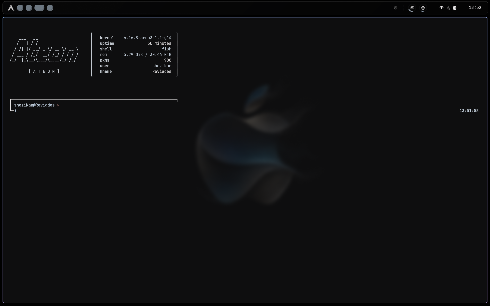
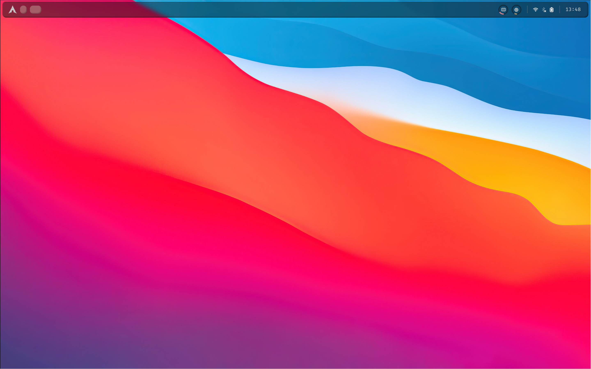
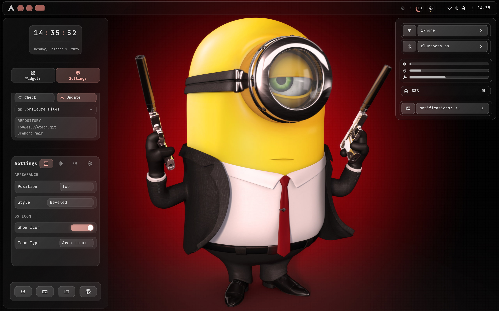
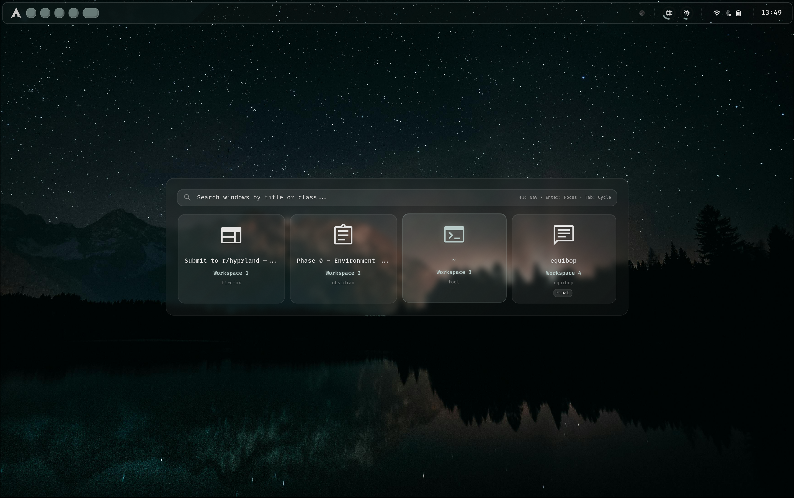

<div align="center">

```
    ___   __                  
   /   | / /____  ____  ____  
  / /| |/ __/ _ \/ __ \/ __ \ 
 / ___ / /_/  __/ /_/ / / / / 
/_/  |_\__/\___/\____/_/ /_/  
```
[](https://github.com/Youwes09/Ateon)
[](https://github.com/Youwes09/Ateon/commits/main)
[](https://github.com/Youwes09/Ateon/commits/main)
[](https://github.com/Youwes09/Ateon/stargazers)

*Powered by AGSv3 • Built with GTK4 • Designed for Hyprland • Packaged with Nix*

</div>

---

## Overview

Ateon is a complete desktop rice featuring a Material Design shell built with [AGS/Astal](https://github.com/Aylur/astal) for [Hyprland](https://github.com/hyprwm/Hyprland). Built upon the foundation of [Matshell](https://github.com/neurarian/matshell), it provides a cohesive desktop experience with intelligent theming, smooth animations, and adaptive layouts that work seamlessly across desktop and laptop configurations.

This is the **Nix-packaged version** with declarative configuration through Home Manager and NixOS modules.

---

## Gallery

<table>
  <tr>
    <td width="50%">
      
      <p align="center"><em>Terminal with Starship Theming</em></p>
    </td>
    <td width="50%">
      
      <p align="center"><em>Sidebar featuring flip clock and integrated settings</em></p>
    </td>
  </tr>
  <tr>
    <td width="50%">
      
      <p align="center"><em>Application launcher with fuzzy search</em></p>
    </td>
    <td width="50%">
      
      <p align="center"><em>MacOS-inspired desktop layout</em></p>
    </td>
  </tr>
  <tr>
    <td width="50%">
      
      <p align="center"><em>Multi-monitor configuration with widgets</em></p>
    </td>
    <td width="50%">
      
      <p align="center"><em>Clipboard manager with history</em></p>
    </td>
  </tr>
  <tr>
    <td colspan="2">
      
      <p align="center"><em>Full desktop showcase with Wilderness theme</em></p>
    </td>
  </tr>
</table>

---

## Project Structure

```
~/Ateon/
├── ags/
│   ├── app.ts                      # Application entry point
│   ├── options.ts                  # Configuration options
│   ├── configs/
│   │   ├── pickerapps.json         # Pinned Apps (Picker)
│   │   └── system/                 # System configuration files
│   │       ├── iconmappings.json
│   │       └── updater.json
│   ├── assets/                     # Icons and default wallpaper
│   │   ├── default_wallpaper/
│   │   └── icons/
│   ├── matugen/templates/          # Theme generation templates
│   │   ├── ags.scss
│   │   ├── ateon-midnight-discord.scss
│   │   ├── fish_colors.fish
│   │   ├── foot.ini
│   │   ├── gtk.css
│   │   ├── hyprland_colors.conf
│   │   └── hyprlock_colors.conf
│   ├── style/                      # SCSS stylesheets
│   │   ├── abstracts/              # Variables, mixins, functions
│   │   ├── base/                   # Reset and base styles
│   │   ├── components/             # Component-specific styles
│   │   │   ├── glass/              # Glass morphism theme
│   │   │   └── normal/             # Standard theme
│   │   └── layouts/                # Layout definitions
│   ├── utils/                      # Utility functions and services
│   │   ├── battery.ts
│   │   ├── bluetooth/              # Bluetooth management
│   │   ├── brightness.ts
│   │   ├── chromash/               # Color theming utility
│   │   ├── clipboard/              # Clipboard manager
│   │   ├── config/                 # Configuration system
│   │   ├── notifd/                 # Notification daemon
│   │   ├── picker/                 # App and wallpaper picker
│   │   ├── updater/                # System updater utility
│   │   ├── wallpaper/              # Wallpaper management
│   │   ├── weather/                # Weather service
│   │   ├── wifi/                   # WiFi management
│   │   └── windowSwitcher/         # Window Switcher (WIP)
│   └── widgets/                    # UI components
│       ├── bar/                    # Status bar
│       ├── clipboard/              # Clipboard interface
│       ├── common/                 # Common widgets & panels
│       ├── control-panel/          # Settings panel
│       ├── dock/                   # Application dock
│       ├── launcher/               # App launcher
│       ├── logout-menu/            # Power menu
│       ├── music/                  # Media player with CAVA
│       ├── notifications/          # Notification popups
│       ├── osd/                    # On-screen display
│       ├── picker/                 # Unified picker interface
│       ├── sidebar/                # Clock and weather sidebar
│       ├── system-menu/            # Quick settings
│       └── window-switcher/        # Window switcher (WIP)
├── hypr/                           # Hyprland configuration
│   ├── hyprland.conf
│   ├── autostart.conf
│   ├── general.conf
│   ├── keybinds.conf
│   ├── monitors.conf
│   ├── workspaces.conf
│   ├── hyprlock/                   # Lock screen wallpapers
│   ├── hyprlock.conf
│   ├── hyprpaper/
│   ├── hyprpaper.conf
│   └── scripts/
│       └── ags-restart.sh
├── fish/                           # Fish shell config
│   └── config.fish
├── foot/                           # Foot terminal config
│   └── foot.ini
├── fastfetch/                      # System info display
│   ├── Ateon-Block.txt
│   ├── Ateon-Text.txt
│   └── config.jsonc
├── matugen/                        # Matugen configuration
│   └── config.toml
├── nix/                            # Nix modules
│   ├── hm-module.nix               # Home Manager module
│   └── nixos-module.nix            # NixOS module
├── extra/                          # Extra assets
│   ├── ATEON-Banner.png
│   ├── Ateon Logo.png
│   └── previews/                   # Preview screenshots
├── scripts/
│   └── GitDraw.sh                  # Backup utility
├── flake.nix                       # Nix flake definition
├── flake.lock                      # Flake lock file
└── starship.toml                   # Starship prompt config
```

---

## Features

<details>
<summary><strong>Dynamic Theming Engine</strong></summary>

Automatic color scheme generation from wallpaper selection using matugen. Real-time theme switching across the entire system including shell components, terminal, and applications. Fine-tune specific colors through the chromash utility for complete control over your aesthetic.

</details>

<details>
<summary><strong>Intelligent Clipboard Manager</strong></summary>

System-wide clipboard history with fuzzy search, live preview, and keyboard-driven navigation. Built with GTK4 and powered by cliphist, supporting multiple content types with efficient memory management. Supports up to 100 entries with smooth scrolling interface limited to 9 visible items.

</details>

<details>
<summary><strong>Audio Visualization</strong></summary>

CAVA-powered sound visualizer with extensive library of visual styles including bars, catmull-rom splines, circular, dots, jumping bars, mesh, particles, smooth, waterfall, and wave particles. Real-time waveform rendering using advanced interpolation for smooth, responsive animations.

</details>

<details>
<summary><strong>Unified Picker Interface</strong></summary>

Integrated wallpaper manager with live preview grid and automatic theme generation on selection. Fast fuzzy search application launcher with adaptive results and instant execution. Both modes accessible through a single, elegant interface.

</details>

<details>
<summary><strong>Notification Center</strong></summary>

Comprehensive notification management with Do Not Disturb mode, grouped notifications by application, action buttons, and notification history. Integrated with system tray for quick access. Live notification popups with customizable timeout.

</details>

<details>
<summary><strong>System Control Panel</strong></summary>

Unified settings interface featuring network management with WiFi scanning and connection controls, Bluetooth device pairing and status monitoring, audio output and input controls with wireplumber integration, brightness adjustment, battery metrics with power profile switching, and quick toggles for common settings.

</details>

<details>
<summary><strong>Digital Flip Clock & Weather Widget</strong></summary>

Sidebar featuring animated flip clock with smooth transitions and live weather information with forecast data. Minimalist design with quick action buttons and additional widget templates for customization.

</details>

<details>
<summary><strong>Performance Monitoring</strong></summary>

Visual CPU and memory usage indicators integrated into the status bar using GTK4 circular progress widgets. Real-time system health tracking with smooth animations.

</details>

<details>
<summary><strong>Multi-Monitor Support</strong></summary>

Optimized for complex display setups with per-monitor configurations, intelligent workspace management, and seamless monitor hotplugging. Pre-configured Hyprland layer rules ensure optimal blur effects and performance across all displays.

</details>

<details>
<summary><strong>Status Bar</strong></summary>

Information-dense status bar with themed Hyprland workspace indicators, system tray integration, performance metrics, media controls, and clock. Adaptive layout adjusts to available space and active components. Includes system information display with battery, Bluetooth, and network status.

</details>

---

## Installation

### Prerequisites

- NixOS or any Linux distribution with Nix package manager installed
- Nix flakes enabled (`experimental-features = nix-command flakes` in `nix.conf`)
- Hyprland compositor (can be managed through the NixOS module)

### Method 1: NixOS Module (Recommended)

Add Ateon to your NixOS configuration:

```nix
{
  inputs = {
    nixpkgs.url = "github:nixos/nixpkgs/nixos-unstable";
    ateon.url = "github:Youwes09/Ateon-Nix";
  };

  outputs = { nixpkgs, ateon, ... }: {
    nixosConfigurations.yourHostname = nixpkgs.lib.nixosSystem {
      modules = [
        ateon.nixosModules.default
        {
          programs.ateon = {
            enable = true;
            # Optional: Enable additional Hyprland integration
            hyprland.enable = true;
          };
        }
      ];
    };
  };
}
```

### Method 2: Home Manager Module

For Home Manager users:

```nix
{
  inputs = {
    nixpkgs.url = "github:nixos/nixpkgs/nixos-unstable";
    home-manager.url = "github:nix-community/home-manager";
    ateon.url = "github:Youwes09/Ateon-Nix";
  };

  outputs = { nixpkgs, home-manager, ateon, ... }: {
    homeConfigurations.yourUsername = home-manager.lib.homeManagerConfiguration {
      modules = [
        ateon.homeManagerModules.default
        {
          programs.ateon = {
            enable = true;
          };
        }
      ];
    };
  };
}
```

### Method 3: Direct Installation

For testing or standalone use:

```bash
# Clone the repository
git clone https://github.com/Youwes09/Ateon-Nix.git ~/Ateon
cd ~/Ateon

# Run directly with nix
nix run .

# Or install to your profile
nix profile install .
```

### Method 4: Development Environment

For development or customization:

```bash
git clone https://github.com/Youwes09/Ateon-Nix.git ~/Ateon
cd ~/Ateon

# Enter development shell
nix develop

# Run in development mode
ags run
```

> [!IMPORTANT]
> On first run, Ateon automatically copies configuration files to `~/.config/ags/`. These files are writable and won't be overwritten on subsequent runs.

---

## Usage

### First Launch

When you first run Ateon, it will automatically:
1. Create the `~/.config/ags/` directory structure
2. Copy configuration files, styles, assets, and matugen templates
3. Set proper permissions for customization
4. Start the shell

All configuration files in `~/.config/ags/` are now editable and persistent.

### Wallpaper & Theme Management

Access the integrated wallpaper picker through the unified picker interface. Select any wallpaper to automatically generate and apply a matching Material Design color scheme across the entire system.

For advanced color customization, chromash is included in the package:

```bash
chromash
```

This provides fine-grained control over specific color values in your generated theme.

### Configuration

#### Shell Settings

Edit `~/.config/ags/configs/pickerapps.json` to customize pinned applications in the picker.

System configuration files are in `~/.config/ags/configs/system/`:
- `iconmappings.json` - Custom icon mappings
- `updater.json` - System updater configuration

#### Hyprland Configuration

The included Hyprland configuration provides:
- Optimized window rules for shell components
- Pre-configured keybindings
- Layer rules for proper blur effects
- Multi-monitor workspace assignments

Copy the Hyprland configs to get started:
```bash
cp -r ~/Ateon/hypr ~/.config/
```

#### Theme Customization

Theme templates are located in `~/.config/ags/matugen/templates/`. These files control:
- Color scheme application across multiple applications
- Material Design token mapping
- GTK, terminal, and application theming

Generated themes are applied to:
- AGS shell components
- Hyprland colors
- Hyprlock lockscreen
- Foot terminal
- Fish shell
- GTK applications
- Discord (Ateon Midnight theme)

### Updating

With Nix flakes, updating is simple:

```bash
# Update flake inputs
nix flake update

# Rebuild your system/home configuration
sudo nixos-rebuild switch --flake .
# or for Home Manager
home-manager switch --flake .
```

### Personal Backup System

Maintain your customizations across multiple machines:

```bash
./scripts/GitDraw.sh
```

This utility creates backups of your configuration or syncs changes from your personal fork.

---

## Component Architecture

| Component | Description | Technology |
|-----------|-------------|------------|
| **Status Bar** | System information, workspace indicators, system tray | GTK4, Astal |
| **App Launcher** | Fuzzy search application access with instant execution | libastal-apps |
| **Wallpaper Manager** | Grid-based wallpaper browser with live preview | GTK4, matugen |
| **Clipboard Manager** | History management with search and content preview | GTK4, cliphist |
| **Notification Center** | Grouped notifications with DND mode and actions | libastal-notifd |
| **System Menu** | Network, Bluetooth, audio, brightness, power controls | Multiple Astal libraries |
| **Music Player** | Media controls with CAVA visualization | libastal-mpris, libastal-cava |
| **Sidebar** | Weather display and animated flip clock | GTK4, libsoup3 |
| **OSD** | On-screen indicators for volume, brightness, Bluetooth | GTK4 |
| **Logout Menu** | Power management interface with confirmation | GTK4 |
| **Control Panel** | Centralized settings and configuration interface | GTK4 |

---

## Dependencies

All dependencies are automatically managed by Nix. The flake includes:

**Core AGS/Astal Libraries:**
- astal4, io, notifd, apps, wireplumber, mpris, network, tray
- bluetooth, battery, powerprofiles, hyprland

**System Utilities:**
- dart-sass, imagemagick, libnotify, wl-clipboard, cliphist
- brightnessctl, hyprpaper, bluez, networkmanager
- grim, slurp, hyprpicker, swappy, playerctl

**Theming:**
- matugen (Material color generation)
- chromash (Advanced color customization)

**GTK/GLib:**
- libgtop, libadwaita, libsoup3, glib-networking

**Icons & Fonts:**
- adwaita-icon-theme, material-design-icons, material-symbols

---

## Troubleshooting

### Configuration not loading
If your changes to `~/.config/ags/` aren't applying:
```bash
# Restart Ateon
pkill ags
ateon
```

### Missing icons or fonts
Icons and fonts are bundled with the package. If you're missing them, ensure the package is properly installed:
```bash
nix profile list | grep ateon
```

### Chromash not found
Chromash is included in the runtime dependencies. If it's not found:
```bash
# Check if it's in PATH
which chromash

# If using the development shell
nix develop
chromash
```

---

## Acknowledgements

This project is built upon the work of numerous talented developers:

**Core Foundation**
- [Neurarian](https://github.com/Neurarian) - [Matshell](https://github.com/neurarian/matshell) provided the architectural foundation
- [Aylur](https://github.com/Aylur) - Creator of AGS/Astal widget toolkit
- [fufexan](https://github.com/fufexan/dotfiles) - Initial inspiration and implementation patterns

**Theming & Visualization**
- [InioX](https://github.com/InioX/matugen) - Material color theming utility
- [kotontrion](https://github.com/kotontrion/kompass) - GTK4 CAVA Catmull-Rom spline widget implementation
- [ARKye03](https://github.com/ARKye03) - GTK4 circular progress widget

**Design Influence**
- [saimoomedits](https://github.com/saimoomedits/eww-widgets) - UI/UX design patterns
- [end-4](https://github.com/end-4/dots-hyprland) - Color generation methodology

Special recognition to the Hyprland and NixOS communities and all contributors who make ambitious desktop customization projects possible.

---

<div align="center">

**[⬆ Back to Top](#ateon)**

Made with ❄️ and Nix

</div>
